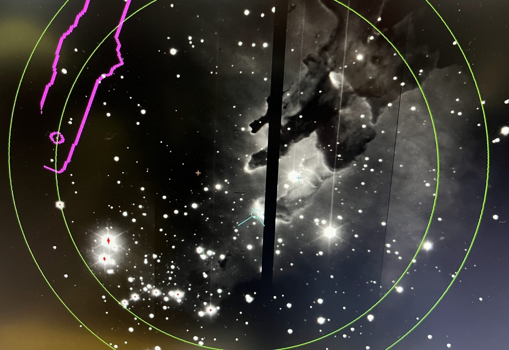

# NIRWALS Simulator

The [Near-Infrared Washburn Astronomical Laboratories Spectrograph (NIRWALS)](https://astronomers.salt.ac.za/instruments/nir/) is an infrared integral field spectrograph for the [Southern African Large Telescope (SALT)](https://www.salt.ac.za/). It provides medium resolution spectroscopy at R = 2000-5000 over the wavelength range of 800 to 1700 nm.

<figure markdown>
  { width="650px" }
  <figcaption>NIRWALS first light image of the Eagle Nebula. Credit: Lisa Crause</figcaption>
</figure>

## Simulator

The NIRWALS Simulator is an online tool, which you can access at [https://simulator.salt.ac.za](https://simulator.salt.ac.za). It should run on any recent version of Firefox, Chrome and Safari.

## User manual

You can find details on how to use the simulator in the [user manual](manual.md).

## Physics and implementation

The [simulator physics](simulator-physics.md) page outlines the physics (and the assumptions made) for the simulator. If you are interested in the implementation details, you may have a look at the [Python code](python-code/index.md) pages.

## Issues? Suggestions? Questions?

If you find a bug or have a suggestion, please let us know by using the project's [issue tracker](https://github.com/saltastroops/nir-simulator/issues) on GitHub. You can also reach us by email at [salthelp@salt.ac.za](mailto:salthelp@salt.ac.za) if you have any questions about the NIRWALS Simulator.
