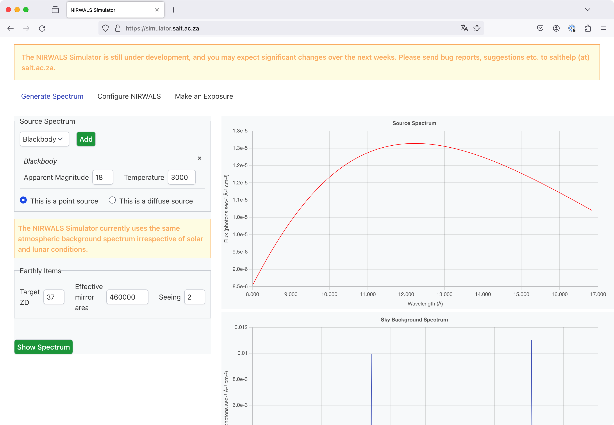
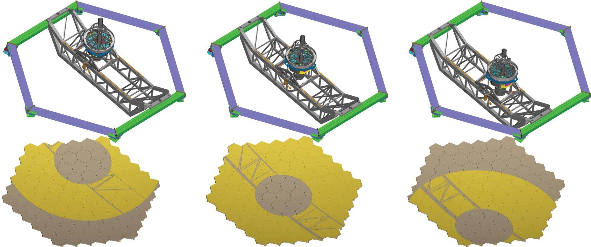
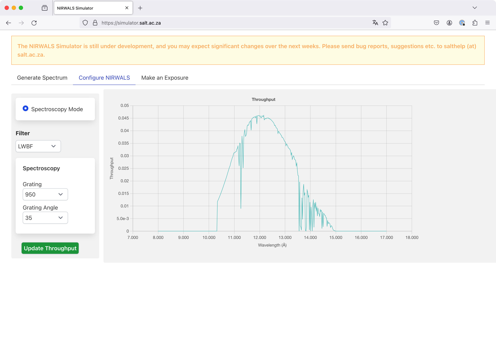
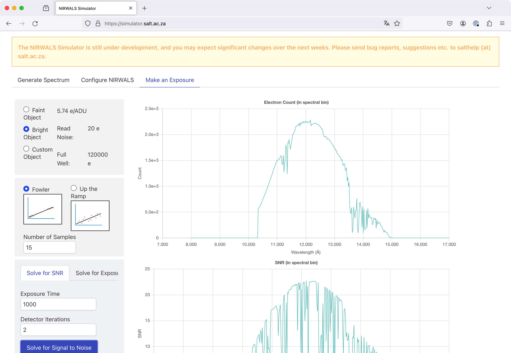

# Manual

The NIRWALS Simulator is a browser-based tool, which you can access online at [https://simulator.salt.ac.za/](https://simulator.salt.ac.za/). It should run in any recent version of Firefox, Chrome or Safari.

The simulator page has three tabs.

Generate Spectrum

: A tab for defining the source spectrum and non-instrument and non-exposure related properties.

Configure NIRWALS

: A tab for defining the instrument setup.

Make an Exposure

: A tab for defining exposure related properties, and for calculating the signal-to-noise ratio.

Let's see how these tabs can be used to simulate a NIRWALS observation.

## Generate Spectrum tab

We start on the Generate Spectrum tab, which conveniently is selected already.

<figure markdown>
  { width="500px" }
  <figcaption>The Generate Spectrum tab with plots shown.</figcaption>
</figure>

### Defining a spectrum
In order to define a spectrum, choose one of the spectrum types from the respective drop-down list and click the Add button. A new form section will appear, which lets you specify parameters related to your spectrum, as outlined in the following sections. Multiple spectra can be defined in this way, and all these spectra are added together. So, for example, you could simulate a blackbody with an emission line by first adding a blackbody and then an emission line. You can delete a spectrum by clicking on the cross in the top right corner of its parameter form, as shown below.

<figure markdown>
  { width="500px" }
  <figcaption>The parameter form for a blackbody spectrum. The button for deleting the spectrum is highlighted.</figcaption>
</figure>

#### Blackbody

The spectrum type "Blackbody" denotes an (ideal) blackbody spectrum. The following parameters can be set.

| Parameter | Description |
| --- | --- |
| Apparent magnitude | The apparent magnitude in the J band. |
| Temperature | The blackbody temperature, in Kelvin. |

#### Galaxy

The spectrum type "Galaxy" denotes a galaxy spectrum. The following parameters can be set.

| Parameter | Description |
| --- | --- |
| Apparent magnitude | The apparent magnitude in the J band. |
| Type | The morphological classification of the galaxy according to the Hubble sequence. The available values are E, S0, Sa, Sb, Sc and Sd. |
| Age | The age of the galaxy. The available values are Young and Old. |
| Redshift | The redshift of the galaxy. |

#### Emission line

The spectrum type "Emission line" denotes a Gaussian emission line. The following parameters can be set.

| Parameter          | Description                                                                                             |
|--------------------|---------------------------------------------------------------------------------------------------------|
| Central wavelength | The central wavelwngth, i.e. the wavelength for the line maximum, in Angstroms.                         |
| FWHM               | The full width at half maximum, in Å.                                                                   |
| Flux               | The total flux in the line, in erg / (cm2 s) or erg / (cm2 s arcsec2). |

### Choosing the source extension

You have to select whether your source is a point source (the default) or a diffuse source. Diffuse sources are assumed to be completely homogeneous and infinite in size. For such sources the magnitude or flux must be given per square arcsecond.

### Earthly items

On this tab you also need to specify a couple of parameters which are not related to the source.

| Parameter             | Description                                                                                                                         |
|-----------------------|-------------------------------------------------------------------------------------------------------------------------------------|
| Target ZD             | The zenith distance of the source, i.e. the angle between the lines from the telescope to the zenith and to the source, in degrees. |
| Effective mirror area | The effective mirror area (see below), in cm2.                                                                           |
| Seeing                | The atmospheric seeing in direction of the zenith, in arcseconds.                                                                   |

As part of the SALT design, the pupil (that is, the view of the mirror as the tracker sees it) moves during the track and exposures, thereby constantly changing the effective area of the telescope. You should choose an average value for your planned observation.

<figure markdown>
  { width="500px" }
  <figcaption>The pupil for three different tracker positions. The grey areas are non-illuminated parts of the mirror.</figcaption>
</figure>

!!! warning

    The current version of the Simulator does not take solar or lunar parameters into account when calculating the sky background.

### Viewing the source spectrum and the sky background

You can view plots of the source spectrum and of the sky background by clicking the Show Spectrum button. These plots are *not* updated when parameter values change; you have to explicitly click the button again to get updated plots.

## Configure NIRWALS tab

Once you are happy with your spectrum (and the other parameters on the Generate Spectrum tab), you can select the Configure NIRWALS tab, on which you can specify the instrument setup abd estimate the throughput.

<figure markdown>
  { width="500px" }
  <figcaption>The Configure NIRWALS tab with plots shown.</figcaption>
</figure>

### Instrument setup

You have to specify the following parameters for the instrument setup.

| Parameter     | Description                                                                                                                |
|---------------|----------------------------------------------------------------------------------------------------------------------------|
| Mode          | The instrument mode. The only option is Spectroscopy Mode.                                                                 |
| Filter        | The filter to use for your observation. The available options are Clear Filter and LWBF (Long Wavelength Blocking Filter). |
| Grating       | The number of grating lines per millimeter. The only available option is 450.                                              |
| Grating angle | The grating angle, i.e. the angle between the grating normal and the incident light rays, in degrees.                      |

### Viewing the throughput

You can generate a plot of the estimated throughput for your chosen parameters by clicking on the Update Throughput button. The throughput shown includes the following factors:

- The atmospheric transmission.
- The mirror efficiency.
- The fibre throughput.
- The filter transmission.
- The grating efficiency.
- The detector quantum efficiency.

This plot is *not* updated when parameter values change; you have to explicitly click the button again to get an updated plot.

## Make an Exposure tab

Once the instrument is configured, you can proceed to the Make an Exposure tab.

<figure markdown>
  { width="500px" }
  <ficaption>The Make an Exposure tab with plots shown.</ficaption>
</figure>

### Detector setup

You have to specify the following detector parameters.

| Parameter         | Description                                                                                                                                        |
|-------------------|----------------------------------------------------------------------------------------------------------------------------------------------------|
| Gain              | The gain, i.e. the number of electrons per ADU.                                                                                                    |
| Read Noise        | The noise for a single detector readout, as a number of electrons.                                                                                 |
| Full Well         | The full well capacity, i.e. the number of electrons a CCD pixel can hold before it saturates. At the time of writing, this parameter is not used. |
| Sampling mode     | The sampling mode. The available optionns are Fowler and Up the Ramp.                                                                              |
| Number of samples | The number of samples taken in a single exposure.                                                                                                  |

Regarding the gain, read noise and full well capacity you can select a predefined set of values suitable for a faint source, select a predefined set of values suitable for a bright source, or specify your own custom value.

### Calculating the signal-to-noise ratio

If you want to calculate the signal-to-noise ratio (SNR) as a function of wavelength, you have to select the Solve for SNR tab near the bottom of the page (unless it is selected already, which it is by default) and specify the following parameters.

| Parameter | Description                                     |
| --- |-------------------------------------------------|
| Exposure Time | The exposure for a single exposure, in seconds. |
| Detector Iterations | The number of exposures to take.                |

Afterwards you can click the Solve for Signal to Noise button to view a plot of the electron count for a spectral bin as a function of the wavelength, as well as a plot of the SNR for a spectral bin, again as a function of the wavelength. These plots are *not* updated when parameter values change; you have to explicitly click the button again to get updated plots.

### Calculating the exposure time

On the other hand, if you want to calculate the SNR at a given wavelength as a function of exposure time, you have to select the Solve for Exposure Time tab and specify the following parameters.

| Parameter | Description                                                                                       |
| --- |---------------------------------------------------------------------------------------------------|
| Requested SNR | The SNR value you need. This is used to decide what SNR range to include in the plot (see below). |
| Wavelength | The wavelength at which the SNR should be calculated.                                             |

You may use the Central Wavelength link to populate the wavelength textfield with the midpoint of the considered wavelength range.

!!! note

    Currently the considered wavelength range is fixed to be the full range available to NIRWALS, i.e. [8000 Å, 17000 Å].

By clicking on the Solve for Exposure Time button you can then view a plot of the electron count for a spectral bin as a function of the wavelength, as well as a plot of the SNR for a spectral bin as a function exposure time. The latter plot covers SNR values from 0 to twice the requested SNR. The plots are *not* updated when parameter values change; you have to explicitly click the button again to get updated plots.

## Is there a Python library?

We currently do not offer a Python library for carrying out the simulations. You are of course welcome to have a look at the [reference page](reference.png) for the code or at the [GitHub repository](https://github.com/saltastroops/nir-simulator.git), but be warned - the required data files are not publicly available at this point in time.
