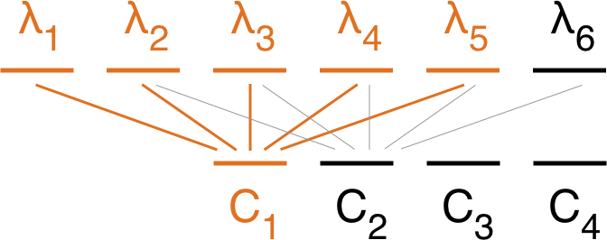

# Overview

## Python modules

The backend for the NIRWALS Simulator is implemented as a Django application. The code
for carrying out the simulations (as explained on the [simulator physics](../simulator-physics.md) page) is found in four modules:

`nirwals.physics.bandpass`

: Functions for throughput calculations. [(View documentation.)](nirwals.physics.bandpass.md)

`nirwals.physics.exposure`

: Functions for signal-to-noise ratio calculations. [(View documentation.)](nirwals.physics.exposure.md)

`nirwals.physics.spectrum`

: Functions for generating the source and sky background spectra. [(View documentation.)](nirwals.physics.spectrum.md)

`nirwals.physics.utils`

: Utility functions. [(View documentation.)](nirwals.physics.bandpass.md)

If you are interested in the code for implementing the URL routes etc., you may have a look at the [project repository](https://github.com/saltastroops/nir-simulator.git).

## Implementation notes

Below are some implementation notes. We use [synphot](https://synphot.readthedocs.io/en/latest/) for implementing the backend, and unless stated otherwise class and method names refer to this library.

### Spectra

All spectra are realised as `SourceSpectrum` instances. Where applicable, a normalised spectrum is generated with a custom `normalize` method. synphot's Johnson J bandpass is used for normalisation.

#### Blackbody

The `BlackBodyNorm1D` model is used with the user-supplied temperature and redshift. The resulting spectrum is normalised.

#### Emission line

The `Gaussian1D`model is used with the user-supplied flux, FWHM and redshift. The resulting spectrum is *not* normalised.

#### Galaxy

The galaxy spectrum is read from file into a `SourceSpectrum`. The user-supplied redshift is applied, and the resulting spectrum is normalised.

#### User-defined

The user-supplied data is read into a `SourceSpectrum`. The resulting spectrum is *not* normalised.

### Bandpasses

All throughput factors are handled in form of bandpass objects, i.e. `SpectrumElement` instances.

#### Atmospheric extinction

The extinction coefficient $\kappa(\lambda)$ for a wavelength $\lambda$ is read from a file, and then the bandpass values are obtained by applying the formula $10^{-0.4\kappa(\lambda)\sec z}$, where $z$ is the zenith distance. This file may first have to be generated from another file which gives the transmission $t$ for a specific zenith distance $z$. To perform the conversion from $t$ to $\kappa$, we note that
$$
t(\lambda, z) = 10^{-0.4\kappa(\lambda)\,\sec z}
$$
and hence
$$
\lg t(\lambda, z) = -0.4\kappa(\lambda)\,\sec z
$$
We can thus convert by means of the following formula:
$$
\kappa(\lambda) = -\frac{\lg t(\lambda, z)}{0.4\sec z}
$$

#### Fibre throughput

##### Point source

The bandpass for the central fibre is a `Flat` bandpass with amplitude
$$
1 - \exp\left(-\frac{r_{\rm fibre}^{2}}{2\sigma^{2}}\right)
$$

##### Diffuse source

The bandpass is a `Flat` bandpass with amplitude 1.

##### Background

The bandpass is a `Flat` bandpass with amplitude 1.

#### Mirror efficiency

The bandpass is created from data in a file.

#### Telescope throughput

The bandpass is created from data in a file.

#### Quantum efficiency

The bandpass is created from data in a file.

### Signal-to-noise ratio

The wavelength covered by a single CCD pixel is
$$
{\rm d}\lambda = \frac{\sigma p\cos\alpha}{f_{\rm cam}}
$$
where $\sigma$ denotes the grating constant, $p$ the pixel size, $\alpha the grating angle and $f_{\rm cam}$ the focal length of the camera lens. We create a binset from $\lambda_{\rm min} - 100\ {\rm\AA}$ to approximately $\lambda_{\rm max} + 100\ {\rm\AA}$ with a stepsize of ${\rm d}\lambda$. (The extra $100\ {\rm\AA}$ are added to avoid artifacts at the boundaries of the wavelength range of interest.) We then create an `Observation` with the source spectrum (or background), the product of the throughput bandpasses as the bandpass, the user-supplied effective mirror area and the binset just calculated.

From the `Observation` we then get the fluxes at the bin centres. Let $n$ be the array of these fluxes and let $n_{k}$ be the array  you get by shifting $n$ $k$-times to the right (for $k \ge 0$) or to the left (for $k \lt 0$). "Gaps" resulting from shifting are filled with zeroes. Then (using trapezoidal intregration) we see that (apart from the first and last bin) the count rate $N[k]$ for the $k$-th bin is approximately
$$
N[k] = \frac{1}{2}{\rm d}\lambda\left(\frac{n[k-1] + n[k]}{2} + \frac{n[k] + n[k+1]}{2}\right) = \frac{1}{4}{\rm d}\lambda\,(n[k-1] + 2 n[k] + n[k+1])
$$
So the array $N$ of count rates is given by
$$
N = \frac{1}{4}{\rm d}\lambda\,(n_{-1} +2n + n_{+1})
$$
The wavelength resolution is given by
$$
\Delta\lambda = \phi_{\rm fibre}\frac{f_{\rm tel}}{f_{\rm col}}\sigma\cos\alpha
$$
Now let $i$ be the smallest integer with $i\cdot{\rm d}\lambda \gt \Delta\lambda$. Then for calculating the SNR at one of the bin wavelengths $\lambda_{k}$, we need to add the count rates in the $i$ bins around that wavelength.

We therefore need to create a [sliding window view](https://numpy.org/devdocs/reference/generated/numpy.lib.stride_tricks.sliding_window_view.html) and then sum over the view's items. The resulting array $C$ will have $i-1$ fewer items than $N$. The count rate relevant for the SNR at $\lambda_{k}$ is $C[k - {\rm floor}(i / 2)]$, as illustrated in the image below.

<figure markdown>
  { width="500px" }
  <figcaption>Using a sliding window view to get from the wavelength binset to the array $C$. The window size is i=5. $\lambda_{3}$ corresponds to $C_{1}$, $\lambda_{4}$ to $C_{2}$, and so on.</figcaption>
</figure>

We therefore shift the binset by ${\rm floor}(i / 2)$ to the left. Then $C$ fulfills the role of $C(\lambda)$ in the formulae in the [SNR section](../simulator-physics.md#signal-to-noise-ratio) of the [simulator physics page](../simulator-physics.md).

